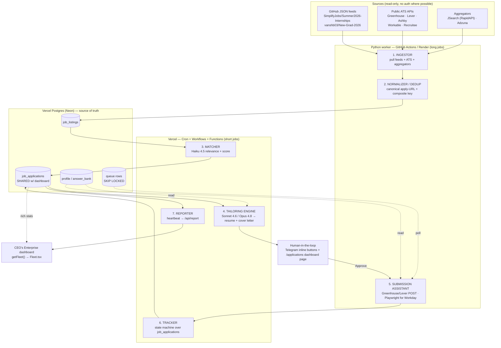

# Jobs Agent — System Architecture

This is the design doc for **Jobs**, the personal recruitment agent that lives in the
`ceos-jobs` owner repo and plugs into the CEO's Enterprise fleet dashboard at
`ceos-enterprise.vercel.app`. Jobs automates the boring 70% of an internship/new-grad job
search for a UC Berkeley SWE/quant/data student — ingesting listings, deduplicating them,
matching them against a profile, tailoring a resume and cover letter, assisting submission,
and tracking everything end to end — while keeping a human in the loop for the 30% that is
either ToS-risky, account-risky, or quality-sensitive.

The single hardest constraint that shapes everything below: **Vercel serverless functions
are stateless, have no persistent filesystem, and are not suited to multi-minute scraping or
browser-automation sessions.** So the architecture splits along the time-budget line.
Anything short and orchestration-shaped runs on Vercel; anything that scrapes, drives a real
browser, or runs for minutes lives in a separate Python worker or GitHub Actions.

---

## 1. Component diagram



The pipeline is a straight line — **ingestor → normalizer/dedup → matcher → tailoring engine
→ submission assistant → tracker → reporter** — with the human gate sitting between tailoring
and submission, exactly where it belongs.

---

## 2. Runtime mapping (where each stage actually runs)

| Stage | Runtime | Why |
|---|---|---|
| **1. Ingestor** | **GitHub Actions** scheduled workflow (`.github/workflows/ingest.yml`, `cron: '0 6,18 * * *'`) | Pulling feeds and polling ATS endpoints is HTTP-only but bursty and Python-native. GitHub Actions gives 2,000 free minutes/month (two ~5-min runs/day ≈ 300 min/month — well inside the limit), no Vercel cold start, and a clean place to hold proxy creds. The morning run lands ~8am PT, right after SimplifyJobs' nightly script. |
| **2. Normalizer / Dedup** | Same Python worker, inline after ingest | Dedup needs the freshly pulled batch in memory; it writes deduplicated rows into `job_listings`. Keeping it in the same process avoids a round trip. |
| **3. Matcher** | **Vercel Cron** (every 15 min) → short function, OR a step inside a **Vercel Workflow** | Relevance classification is a fast Haiku call per listing — well under the 300s default function limit. Cron polls `job_listings` for `status='ingested'` and classifies in batches of 20. |
| **4. Tailoring engine** | **Vercel Workflows** (GA Oct 2025) | Multi-step LLM orchestration that may pause for human approval. Each Workflow step gets its own full 800s budget (Pro/Fluid Compute) and resumes deterministically — this is exactly the pause-resume-retry shape Workflows are built for, and it removes the need for a home-rolled state machine. |
| **5. Submission assistant** | **Greenhouse/Lever**: short Vercel function (direct `POST`). **Workday/iCIMS/Taleo/Ashby hosted form**: **Python worker** (Playwright) triggered via a queue row. | A `POST` to Greenhouse's Job Board API is a sub-second HTTP call — fine on Vercel. A 5–8 step Workday wizard with a real browser, account-creation wall, and ~15-min session is categorically a separate-worker job; it will never survive a serverless invocation. |
| **6. Tracker** | **Vercel function** + a **Vercel Cron** sweep | Status transitions happen synchronously on events (submission result, approval). A daily cron sweep handles the 21-day ghosting check and flips stale `submitted` rows. |
| **7. Reporter** | End of every worker/Workflow run | Fires the heartbeat `POST` to `/api/report` (see §8). Cheap, always last. |

**Rule of thumb:** if a stage touches a browser, rotates proxies, or runs longer than a few
seconds, it is a GitHub Actions / Render worker job. Everything else is Vercel Cron or a
Vercel Workflow step. A $7/mo Render or Railway box is the upgrade path **only** if we later
need sub-30-min scrape freshness or a persistent Playwright session for Workday — deferred,
not built day one.

---

## 3. Core data model

The system of record is **Vercel Postgres (Neon under the hood)**. The full DDL lives in
[`db/schema.sql`](../db/schema.sql); this section is the prose explanation. Three logical
groups of tables, plus a queue.

### `job_listings` — everything we've discovered
One row per *unique* posting, written by the normalizer. Columns: `id` (UUID), `source`
(`simplify` | `vanshb03` | `greenhouse` | `lever` | `ashby` | `jsearch` | `adzuna`),
`external_id`, `company`, `title`, `location`, `ats_type`, `apply_url`, `jd_url`,
`jd_text` (stored **at discovery time** — postings vanish when roles close, and we need the
text later for tailoring and interview prep), `posted_at`, `closed_at`, `active`, `dedup_key`,
`status` (`ingested` | `classified` | `irrelevant`), `created_at`. A `UNIQUE (source,
external_id)` constraint blocks duplicate ingestion at the DB level; a separate
`dedup_key` (see §4) catches the *same job seen across different sources*.

### `job_applications` — the pipeline, and the SHARED fleet table
This is the table the dashboard reads to compute rich stats, so its shape is part of the
integration contract (§8). One row per application attempt, FK to `job_listings`. Columns
include `id`, `listing_id`, `company`, `title`, `location`, `status` (the 9-stage machine
below), `status_updated_at`, `submitted_at`, `resume_version` (a **first-class FK from day
one** — the single highest-signal A/B test we have), `cover_letter_id`, `source_channel`
(required, not nullable: `company_careers_page` | `referral` | `niche_board` | `aggregator`
etc.), `ats_type`, `classification_score`, `apply_url`, `notes`, `created_at`. We **mark
listings inactive rather than delete** so we can analyze application timing later.

The status machine is **forward-only**, enforced by a `STATUS_RANK` ordering with
write-protected terminal states:

```
Discovered → Queued → Tailoring → Ready → Submitted
           → OA/Assessment → Interviewing → Offer
           → Closed (Rejected | Ghosted | Declined)
```

`Tailoring → Ready` is a **human gate** — the agent never advances it on its own.

### `profile` / `answer_bank` — the single source of truth for autofill
A small set of rows (effectively a singleton profile plus a library of canned answers) holding
the canonical JSON application profile: full name, Berkeley + personal email, phone, LinkedIn,
GitHub, GPA, major, graduation date, work/internship history (with 2–3 bullets each), projects,
skills, work-authorization status, sponsorship need, voluntary EEO answers (decided once), and
a library of long-form answers ("Why this company?", "Describe a technical challenge"). **Every
layer reads from this one place** — the Greenhouse `POST` script, the Playwright autofill, and
the tailoring engine — so there is exactly one truth to maintain. The master *resume* itself is
a structured YAML profile (RenderCV schema) tracked in git; the LLM only ever reads from it,
never mutates it.

### Queue rows — Postgres-as-queue
Rather than add a broker, the worker pulls work with the well-worn crash-safe pattern:

```sql
SELECT id, payload FROM job_queue
WHERE status = 'pending' AND next_attempt_at <= NOW()
FOR UPDATE SKIP LOCKED
LIMIT 1;
```

`SKIP LOCKED` is crash-safe (the lock releases if the worker dies), handles far more than our
volume, and needs no extra service. **Upstash Redis** (the successor to the now-deprecated
Vercel KV) is used only for *ephemeral* state — a dedup bloom filter of seen job IDs (30-day
TTL), rate-limit counters, and the pending-approval set — never for durable job state.

---

## 4. Deduplication

Two layers, cheapest first:

1. **Hard key (the 90% case).** A `dedup_key` = `normalize(company) || '|' || normalize(title)
   || '|' || normalize(location)`, plus a normalized **canonical apply URL** (strip tracking
   params with `urllib.parse`). Two different sources routinely surface the same job with
   different metadata; the canonical URL collapses them. This is a `UNIQUE` constraint —
   zero-cost dedup.
2. **Near-duplicate (the long tail).** "Software Engineer Intern" vs "SWE Intern 2025" won't
   hard-match. For our volume (<2,000 roles/cycle) we run an exact-key pass first, then flag
   pairs with Levenshtein distance < 0.15 on title *within the same company* into a
   `flagged_duplicates` table for human review. `datasketch` MinHash LSH (threshold 0.85 on
   3-gram shingles) is the heavier fallback if the simple approach proves noisy.

---

## 5. LLM layer

All LLM work goes through the **Anthropic API**. Model per task — and **only these current
model ids** — tuned for cost vs. capability:

| Task | Model | Model id | Rationale |
|---|---|---|---|
| Dedup title normalization, relevance classification, structured field extraction from raw HTML | **Haiku 4.5** | `claude-haiku-4-5` | High volume, simple judgments. ~$0.001/application. Output a strict JSON schema `{relevant: bool, score: 0-10, reason: str}`. |
| JD requirement parsing, skills-gap analysis, routine resume bullet rewriting, first-draft cover letter | **Sonnet 4.6** | `claude-sonnet-4-6` | The workhorse for grounded rewriting. ~$0.05/application tailoring pass. |
| Final cover-letter polish, and any application needing a custom long-form essay or tricky reasoning (inferring unstated requirements, culture-fit) | **Opus 4.8** | `claude-opus-4-8` | Reserved for quality-critical prose and hard reasoning; its 1M-token context lets us feed full JD + full resume + company research in one call. ~$0.15/application, gated behind explicit approval. |

**Cost & controls.** At ~50 relevant JDs/day and ~10 approvals/day, the run rate is roughly
$120/month; routing the Sonnet tailoring pass through the **Anthropic Batch API** (50% off,
overnight, also dodges rate limits) brings it to ~$80/month. Set hard spend limits in the
Anthropic console. Mind the Tier-1 default rate limit (50 req/min) — classify in batches of 10
with a short gap, or use Batch for non-urgent passes.

**Anti-hallucination is non-negotiable.** The tailoring engine is grounded strictly to the
master profile. Required guardrails: (1) a system prompt that says *"Use only facts from the
provided source data — do not invent metrics, technologies, or experience not present; if you
cannot improve a bullet without inventing facts, return it unchanged"*; (2) Pydantic-schema'd
output for field-level grounding; (3) a content-preservation gate — cosine similarity (or
`difflib.SequenceMatcher`) between each rewritten bullet and its source, flagging anything
below ~0.72; (4) a human side-by-side diff review before any file is saved for submission. A
fabricated "40% latency reduction" surfaces in a technical interview and can cost an offer — it
is the highest-priority risk in the whole system. Resumes render deterministically via
**RenderCV / Typst** (single-column only — Workday and Taleo parse strictly top-to-bottom and
scramble tables/sidebars), and every generated PDF is smoke-tested through the free
`sunnypatell/ats-screener` simulation before use.

---

## 6. Queue, secrets, and environment

**Queue:** Postgres-as-queue with `SELECT ... FOR UPDATE SKIP LOCKED` (see §3). Use Neon's
pooled (pgBouncer) connection string (`?pgbouncer=true`) and cap pool size to ~5 per function
instance, because parallel Vercel Workflow steps can otherwise exhaust the 20-connection limit.
A partial index on `status WHERE status NOT IN ('submitted','rejected')` keeps queue polling
fast.

**Secrets / env:** all secrets are **Vercel sensitive environment variables** (never committed
`.env`):
- `ANTHROPIC_API_KEY` (validate `^sk-ant-` on startup)
- `DATABASE_URL` (Vercel Postgres / Neon, pooled)
- `UPSTASH_REDIS_REST_URL`, `UPSTASH_REDIS_REST_TOKEN`
- `TELEGRAM_BOT_TOKEN`
- `REPORT_SECRET` (shared with the fleet dashboard — see §8)
- `RAPIDAPI_KEY` (JSearch), `ADZUNA_APP_ID`, `ADZUNA_APP_KEY`

The GitHub Actions worker gets the same `DATABASE_URL` plus any proxy creds as **GitHub
repository secrets**, injected via the workflow YAML. Keep a committed `.env.example` listing
every key with no values, and add a startup validator in both runtimes that asserts all
required vars are present and well-formed before doing any work. **Never** expose
`ANTHROPIC_API_KEY` or `DATABASE_URL` to the client bundle. API keys for JSearch/Adzuna in a
public repo get their quota stolen — keep them server-side only.

---

## 7. Notifications & human-in-the-loop

The automation boundary is firm: **discovery through tailoring is fully automated; submission,
follow-up sends, interview scheduling, and offer negotiation stay human.**

**Primary surface — Telegram bot** (`python-telegram-bot`). When a row reaches
`pending_approval`, the bot sends one message per application — company, role, the resume
*diff*, and a cover-letter preview — with three inline buttons:
- **Approve** → transitions the Workflow to submission (Greenhouse/Lever `POST`, or enqueue a
  Playwright task for Workday).
- **Skip** → mark the application closed/declined.
- **Rewrite** → re-queue for an Opus 4.8 polish pass (gated this way to control Opus spend).

For Workday browser submissions specifically, the bot sends a **screenshot of the filled form**
before the worker clicks Submit. Pending rows carry a 48-hour TTL; on timeout we send a
reminder and mark expired.

**Secondary surface — the dashboard.** An `/applications` page on the existing CEO's Enterprise
dashboard, reading Vercel Postgres via a Server Action with SWR polling (~10s), showing company,
role, source, status, tailoring score, `submitted_at`, and response. It carries the analytics
the off-the-shelf trackers (Teal/Simplify/Huntr) all lack: **per-source yield** and **interview
rate by `resume_version`**. A manual override can re-trigger tailoring or force-approve.

**Email** (Resend/Postmark) is for low-urgency confirmations and a weekly digest only.

**Hard rule — never auto-send outbound email to recruiters.** LLM-drafted follow-ups land in a
`pending_emails` table with a Send button on the dashboard; one hallucinated company name in a
follow-up can blacklist a candidacy. Gmail ingestion (status detection) uses `gmail.readonly`
only — never `gmail.send` for automated outbound. And **Jobs does not touch LinkedIn or
Handshake automation at all** — those accounts are the owner's real professional identity, and
the ban risk (LinkedIn's 2025 velocity detection; Handshake's explicit anti-bot ToS) is
catastrophic and asymmetric.

---

## 8. Fleet integration — reporting to CEO's Enterprise

Jobs integrates with the fleet the same way the **growth** agent does, mirrored verbatim in
style. Two mechanisms:

**(a) Heartbeat to `/api/report`.** After every run, the reporter `POST`s:

```
POST https://ceos-enterprise.vercel.app/api/report
headers: { 'x-report-secret': REPORT_SECRET, 'content-type': 'application/json' }
body:    { agentId: 'jobs', status: { state, lastRun, summary, ok } }
```

The dashboard's `registry.upsertStatus()` writes this to the Postgres `agent_status` table
(KV fallback key `agent:status:jobs`). The `AGENTS` registry on the dashboard side gains a
`jobs` entry (`ownerRepo: 'ceos-jobs'`) filling one of the open Phase-4 slots.

**(b) Rich stats over the shared `job_applications` table.** Just as `growth` doesn't merely
push a status string — `getGrowthStats()` aggregates the shared `businesses` table and
`getFleet()` overrides the growth status with a computed summary — Jobs writes its pipeline
rows into the shared `job_applications` table, and the dashboard adds a parallel `lib/jobs.ts`
exporting `getJobStats()` (a single aggregate SQL over `job_applications`) plus a `getFleet()`
merge block for `agentId 'jobs'`. The computed summary mirrors growth's format, e.g.:

```
142 found · 38 applied · 9 OAs · 4 interviews · 1 offer
```

So the heartbeat keeps the agent's `state`/`lastRun` fresh, while the shared-table aggregate
gives the fleet view real, queryable pipeline numbers — no extra status plumbing.

---

## 9. Key technical decisions & rationale

1. **Vercel for orchestration, separate worker for scraping/browser.** Serverless functions
   are stateless with no persistent FS and a wall-clock ceiling; scraping and Playwright are
   inherently long and stateful. Splitting on this line is the load-bearing decision — it keeps
   us inside the existing Vercel bill for the cheap 70% and isolates the expensive, fragile 30%.

2. **Vercel Workflows over a home-rolled cron+state-machine for the agent loop.** Workflows give
   per-step 800s budgets, deterministic resume, automatic retry, and native pause-for-approval —
   exactly the human-in-the-loop shape we need, with no extra Postgres state machine to maintain.

3. **Postgres-as-queue (`SKIP LOCKED`), not a broker.** Crash-safe, sufficient for our scale,
   zero new infrastructure. Upstash Redis stays in its lane: ephemeral dedup/rate-limit state only.

4. **Tiered models — Haiku 4.5 / Sonnet 4.6 / Opus 4.8.** Spend Haiku money on classification,
   Sonnet on routine tailoring, and Opus only where prose quality or hard reasoning actually
   pays for itself. Batch API halves the bulk cost. This is the difference between ~$80 and a
   blown LLM budget.

5. **GitHub JSON feeds first, public ATS APIs second, aggregators third — and no LinkedIn /
   Handshake / Indeed scraping ever.** SimplifyJobs + vanshb03 give 500–1,500 structured,
   pre-deduplicated listings daily with zero scraping risk; Greenhouse/Lever/Ashby public APIs
   catch target-company postings 12–24h earlier. The auth-walled, litigated sources are pure
   downside for an individual student.

6. **Human gate between tailoring and submission, always.** Direct API submission to
   Greenhouse/Lever is fine to fully automate up to the click; everything else (Workday account
   walls, custom essays, recruiter email) stays human. Quality beats volume — the documented
   "5,000 applications → 0.5% interview rate" is the cautionary tale this whole design rejects.

7. **Anti-hallucination guardrails treated as a hard requirement, not a nicety.** Grounding
   prompt + Pydantic schema + content-preservation scoring + human diff. A fabricated metric is
   a career risk, not a bug.

8. **Mirror the growth agent's fleet integration exactly.** Heartbeat to `/api/report` for
   liveness, shared `job_applications` table for rich stats via `getJobStats()` + a `getFleet()`
   merge. Reusing the proven pattern means the dashboard needs only the additive `jobs` wiring.
